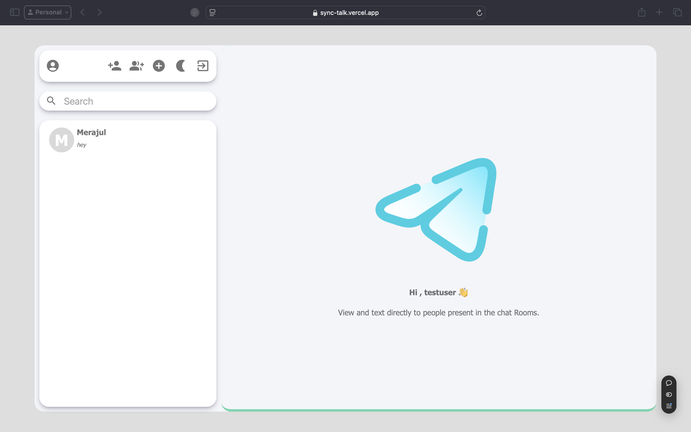
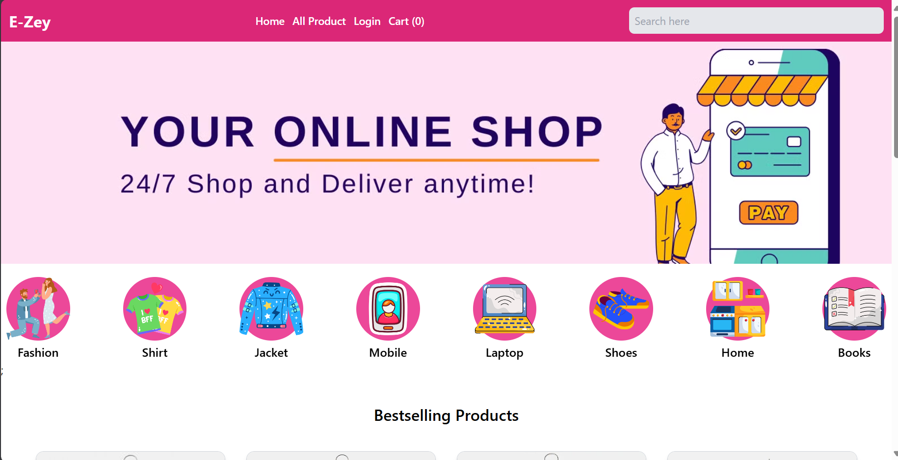
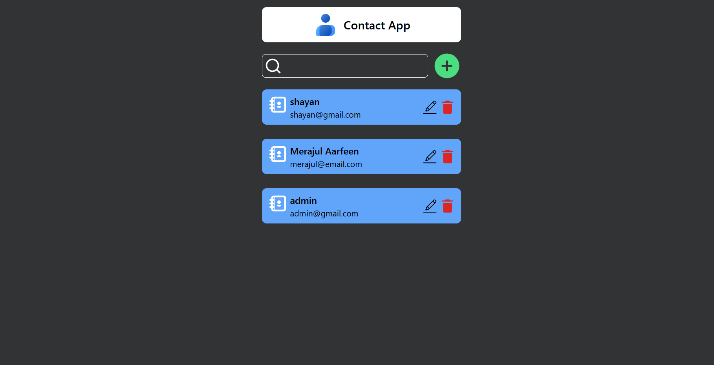

  
  
   

  

  

<h1 align="center">Welcome to My GitHub Profile! 👨‍💻</h1>

  Passionate about creating impactful and high-quality Stuffs. Let's build something amazing together!

---

## 👨‍💻 About Me

I am **Merajul Aarfeen**, a software developer passionate about building web applications using **React**, **JavaScript**, and various modern web technologies. I love to work on exciting projects and solve complex coding challenges.

- 🌍 From: **India**
- 🔭 Current Focus: **Backend Development**
- 🎯 Always learning new tools and frameworks to enhance my skills.
- 💼 You can explore my work and contributions below.

---

## 🌐 Portfolio

Check out my portfolio for more about my work, skills, and projects:  
**[Merajul Aarfeen's Portfolio](https://merajul-aarfeen-shayan.vercel.app/)**  

---

## 🛠 Tools & Technologies

### Languages

  
  
  
  
  
  
  
  
  

### Frameworks & Libraries

  
  
  
  
  
  
  
  
  

### Tools & Platforms

  
  
  
  
  

---
## 🚀 Deployed Projects

  <!-- Project 1 -->
  

    
    <h3>🌟 sync Talk </h3>
    
SyncTalk is a real-time chat application built on the MERN stack, utilizing Socket.IO to enable seamless, instant messaging. With features designed for responsive and efficient communication, SyncTalk offers a modern, intuitive interface, perfect for connecting users instantly across any device.

    
    
  

X X X

  <!-- Project 2 -->
  

    
    <h3>🌟 E-Zey </h3>
    
A responsive e-commerce web application built with React, styled using Tailwind CSS, and state management powered by Redux and Context API. It includes an authentication system for secure user registration, login, and profile management. Features real-time product browsing, dynamic cart updates, and a fully functional checkout process.

    
    
  

X X X

<!-- Project 3 -->
  

    
    <h3>🚀 Infinite Ink</h3>
    
Infinite Ink is a blog application designed to provide a simple yet effective platform for users to create, read, and manage blog posts. Built with React for the front-end and integrated with Appwrite for backend services, this app serves as an ideal project for beginner developers looking to enhance their skills in web development.

    
    
  

  
X X X
  <!-- Project 4 -->
  

    
    <h3>🚀 Contact App</h3>
    
This is a simple and responsive Contact App built using React.js. The app allows users to manage their contacts efficiently

    
    
  

  
X X X

## 📈 GitHub Stats

  
  

---

## 🌐 Connect with Me

  
  
  
  
  
  

